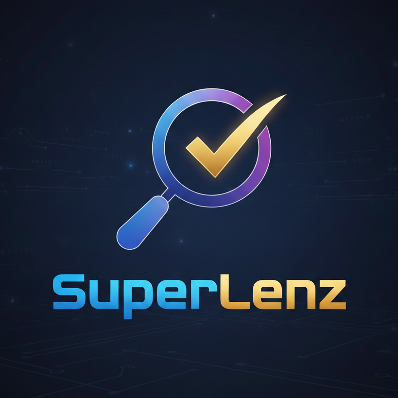

<p align="center">
  
</p>

# SuperLenz

> *Lenz — from Latin "lenticula" (lens). A super-powered lens that magnifies the truth.*
> SuperLenz searches multiple sources, cross-verifies every claim through 10+ rounds, and delivers only credible, validated research.

**High-credibility research automation with multi-source cross-verification (10+ rounds)**

A Model Context Protocol (MCP) server that automates research tasks with a focus on credibility and accuracy. It performs automatic searching, collection, cross-verification (10+ rounds), and saves results to your preferred storage.

## Features

- **Multi-Source Search**: Web search (Brave, Exa), academic papers (arXiv, Semantic Scholar), GitHub
- **10-Round Cross-Verification**: Keyword overlap matching (rounds 1-4), conflict detection (5-8), optional LLM verification (9-10)
- **Credibility Scoring**: Authority assessment, temporal validation, source weighting
- **Flexible Storage**: Markdown (default), JSON
- **Plugin Architecture**: Extensible storage and search providers

## Requirements

- Node.js >= 18.0.0
- Any MCP-compatible client

## Environment Variables

SuperLenz reads these from the system environment. If a key is available, the corresponding feature is automatically enabled. No key is strictly required — arXiv search is always available.

| Variable | Required | Description |
|----------|----------|-------------|
| `BRAVE_SEARCH_API_KEY` | No | Brave Search API key |
| `EXA_API_KEY` | No | Exa Search API key |
| `SEMANTIC_SCHOLAR_API_KEY` | No | Semantic Scholar API key (improves rate limits) |
| `GITHUB_TOKEN` | No | GitHub token for repository search |
| `ANTHROPIC_API_KEY` | No | Enables LLM-based verification (rounds 9-10) |
| `OUTPUT_PATH` | No | Output directory for saved documents (default: `./output`) |

> **Tip:** If your MCP client supports an `"env"` field, you can pass keys there instead of setting them system-wide.

---

## MCP Client Configuration

All examples below use **npx** — no prior installation required.

### Claude Desktop

> No CLI — edit the JSON config file directly.

Edit `~/Library/Application Support/Claude/claude_desktop_config.json` (macOS) or `%APPDATA%\Claude\claude_desktop_config.json` (Windows):

```json
{
  "mcpServers": {
    "superlenz": {
      "command": "npx",
      "args": ["-y", "superlenz"]
    }
  }
}
```

### Claude Code (CLI)

**Option A — CLI command:**

```bash
claude mcp add superlenz -- npx -y superlenz
```

| Flag | Description |
|------|-------------|
| `-s local` | Save to `.claude/settings.local.json` (default) |
| `-s user` | Save to `~/.claude/settings.json` (all projects) |
| `-s project` | Save to `.mcp.json` in the current project root |
| `-e KEY=val` | Set an environment variable |
| `-t <transport>` | Transport type: `stdio` (default), `sse`, `http` |

Management commands:

```bash
claude mcp list              # list registered servers
claude mcp remove superlenz  # remove a server
```

**Option B — JSON config:**

Edit `~/.claude/settings.json` (or `.claude/settings.json` at the project root):

```json
{
  "mcpServers": {
    "superlenz": {
      "command": "npx",
      "args": ["-y", "superlenz"]
    }
  }
}
```

### Cursor

> No CLI "add" command — edit the config file or use the Settings UI.

Open **Settings > MCP Servers** and add, or edit `.cursor/mcp.json` (project) / `~/.cursor/mcp.json` (global):

```json
{
  "mcpServers": {
    "superlenz": {
      "command": "npx",
      "args": ["-y", "superlenz"]
    }
  }
}
```

Management commands (in Cursor's terminal):

```bash
cursor agent mcp list                # list servers
cursor agent mcp enable <id>         # enable a server
cursor agent mcp disable <id>        # disable a server
```

### VS Code (Copilot)

**Option A — CLI command:**

```bash
code --add-mcp '{
  "name": "superlenz",
  "command": "npx",
  "args": ["-y", "superlenz"]
}'
```

**Option B — JSON config:**

Edit `.vscode/mcp.json` in your workspace. Note: VS Code uses the `"servers"` key (not `"mcpServers"`).

```json
{
  "servers": {
    "superlenz": {
      "command": "npx",
      "args": ["-y", "superlenz"]
    }
  }
}
```

Or add to VS Code `settings.json` under `"mcp.servers"`.

### Gemini CLI

**Option A — CLI command:**

```bash
gemini mcp add superlenz npx -y superlenz
```

Management commands:

```bash
gemini mcp list              # list registered servers
gemini mcp remove superlenz  # remove a server
```

**Option B — JSON config:**

Edit `~/.gemini/settings.json`:

```json
{
  "mcpServers": {
    "superlenz": {
      "command": "npx",
      "args": ["-y", "superlenz"]
    }
  }
}
```

---

## MCP Tools

### `start_research`

Start a new research session. Searches multiple sources, cross-verifies claims, generates a document, and saves the result.

| Parameter | Type | Default | Description |
|-----------|------|---------|-------------|
| `topic` | string | *(required)* | Research topic or question |
| `urls` | string[] | — | Initial URLs to include in research |
| `depth` | `"quick"` \| `"standard"` \| `"deep"` | `"standard"` | Verification depth (5 / 10 / 15 rounds) |
| `storage` | `"markdown"` \| `"notion"` \| `"json"` \| `"html"` \| `"confluence"` | `"markdown"` | Storage provider for the final document |
| `template` | `"comprehensive"` \| `"executive-summary"` \| `"comparison"` \| `"guide"` | `"comprehensive"` | Document template |

### `search_sources`

Search for sources across multiple providers without running a full research pipeline.

| Parameter | Type | Default | Description |
|-----------|------|---------|-------------|
| `query` | string | *(required)* | Search query |
| `sources` | string[] | `["web", "academic"]` | Providers: `web`, `academic`, `github`, `youtube`, `reddit` |
| `limit` | number | `10` | Maximum results per source (1-50) |
| `minRelevance` | number | `0.5` | Minimum relevance score (0-1) |

### `get_research_status`

Get the current status of a research session.

| Parameter | Type | Default | Description |
|-----------|------|---------|-------------|
| `sessionId` | string | *(required)* | Session ID to check |

### `list_sessions`

List all research sessions with optional filtering.

| Parameter | Type | Default | Description |
|-----------|------|---------|-------------|
| `status` | string | — | Filter by status: `initializing`, `searching`, `collecting`, `verifying`, `generating`, `saving`, `completed`, `failed` |
| `limit` | number | `20` | Max sessions to return (1-100) |

### `cross_verify`

Cross-verify a list of claims against optional source URLs.

| Parameter | Type | Default | Description |
|-----------|------|---------|-------------|
| `claims` | string[] | *(required)* | List of claims to verify |
| `topic` | string | *(required)* | Topic context for verification |
| `sources` | string[] | — | Optional source URLs to check against |

### `save_to_storage`

Save a previously generated research document to a storage provider.

| Parameter | Type | Default | Description |
|-----------|------|---------|-------------|
| `sessionId` | string | *(required)* | Session ID of the research to save |
| `provider` | `"markdown"` \| `"json"` | `"markdown"` | Storage provider |
| `destination` | string | — | Custom file path or name |

---

## License

MIT
